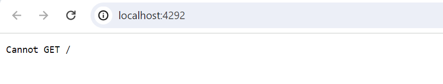
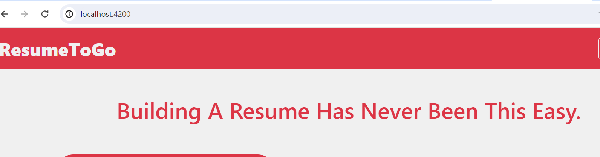
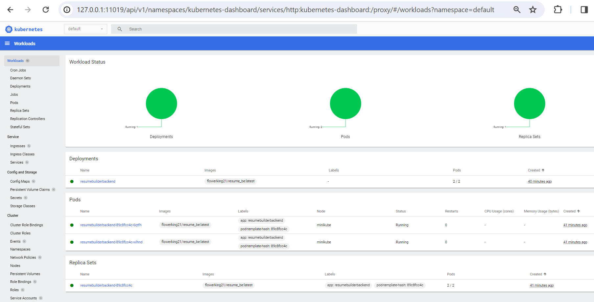
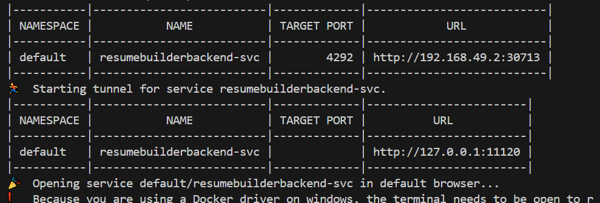

# ResumeAI

## Overview

The project is a MEAN project and uses Node.js version 18.

# Run Project Locally

1. **Clone the repository** in your local system.
2. **Create a `.env` file** for environment variables:
    ```env
    MONGO_URL="mongodb+srv://**************/resume_builder"
    JWT_SECRET_KEY="MYREALLYSECRETKEY"
    OPENAI_KEY="OPENAI_API_KEY"
    GMAIL_USER="THIS EMAIL IS USED TO SEND RESUMES"
    GMAIL_PASS="PASSWORD USED BY NODEMAILER"
    FRONT_END="URL FOR FRONTEND"
    ```
3. Navigate to the `ResumeBuilderBackend` folder and **install the dependencies**:
    ```bash
    npm install
    npm install -g typescript
    tsc --build
    ```
4. After installing, **build the application**:
    ```bash
    npm run start
    ```
5. Test the `localhost:4292` for output:
    ```
    Cannot GET /
    ```
    

6. Navigate to the `ResumeBuilderAngular` folder and **install the dependencies**:
    ```bash
    npm install -g @angular/cli
    npm install -g angular-http-server
    npm install --force
    ```
7. Run the application:
    ```bash
    npm start
    ```
8. Test the `localhost:4200` for output:
    

Congrats! Your local setup is complete. Next, proceed with the Dockerfile.

# Create a Dockerfile and Push it into ECR

## Backend Deployment

1. Clone the project and ensure `.env` updates are already completed.
2. Create a **Dockerfile** for the backend, specifying the Node.js version, dependencies, dist file creation, and command to run the application.
3. Update the Dockerfile in the `ResumeBuilderBackend` folder.
4. Build and test the Dockerfile locally:
    ```bash
    docker build -t <docker-image-name> .
    docker run -p 4292:4292 <docker-image-name>
    ```
5. Test the `localhost:4292` for output:
    ```
    Cannot GET /
    ```
6. Push the image to Docker Hub and Amazon ECR:
    ```bash
    # Create a repository
    aws ecr create-repository --repository-name <name> --region <region>

    # Login
    aws ecr get-login-password --region <region> | docker login --username AWS --password-stdin <aws_account_id>.dkr.ecr.<region>.amazonaws.com

    # Tag the Docker image
    docker tag <image> <aws_account_id>.dkr.ecr.<region>.amazonaws.com/<repository>:<tag>

    # Push the image
    docker push <aws_account_id>.dkr.ecr.<region>.amazonaws.com/<repository>:<tag>
    ```

**Backend image successfully pushed to ECR!**

## Frontend Deployment

Repeat the backend steps, changing the port to `4200` in the Dockerfile. Follow the same steps to push the frontend image to ECR.

**Frontend deployment complete!**

# Docker Compose

1. Create a **docker-compose.yml** file:
    - Backend service runs on port `4292`.
    - Frontend service runs on port `4200`.
2. Use the following command to build the images and deploy:
    ```bash
    docker-compose up
    ```

**Docker Compose deployment complete!**

# Kubernetes Deployment (Local - Minikube)

1. Create a Kubernetes **deployment.yaml** file in the `ResumeBuilderBackend` folder.
2. Define the deployment to manage pods and services, specifying the image, number of replicas, and ports.
3. Create a **service.yaml** file to define the service name and port.
4. Deploy the application:
    ```bash
    kubectl apply -f deployment.yaml
    kubectl apply -f service.yaml
    ```
5. Verify deployment, pods, and services:
    ```bash
    kubectl get deployments
    kubectl get pods
    kubectl get svc
    ```
6. Open the Minikube dashboard:
    ```bash
    minikube dashboard
    ```
    

7. Expose the backend service and open the URL:
    ```bash
    minikube service resumebuilderbackend-evc
    ```
    

**Backend successfully deployed using Kubernetes (Minikube)!**

# GKS Deployment (Google Kubernetes Engine)

1. **Create a GKE Cluster**:
    ```bash
    gcloud container clusters create resumebuilder-cluster \
        --num-nodes=3 \
        --region=<region>
    ```

2. **Push Docker Images to Google Container Registry (GCR)**:
    ```bash
    docker tag <image-name> gcr.io/<project-id>/<image-name>:<tag>
    docker push gcr.io/<project-id>/<image-name>:<tag>
    ```

3. **Deploy to GKE**:
    - Update `deployment.yaml` to use the GCR-hosted image.
    - Apply the configuration:
        ```bash
        kubectl apply -f deployment.yaml
        kubectl apply -f service.yaml
        ```

4. **Verify the GKE Deployment**:
    ```bash
    kubectl get deployments
    kubectl get pods
    kubectl get svc
    ```

5. **Expose the Service**:
    ```bash
    kubectl expose deployment resumebuilder-backend \
        --type=LoadBalancer \
        --port=80 --target-port=4292
    ```

6. **Access the Application**:
    - Use the external IP of the Load Balancer to access the application.

**GKS Deployment for ResumeBuilder successfully completed!**
